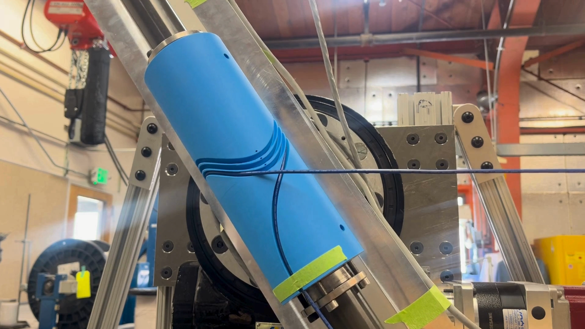
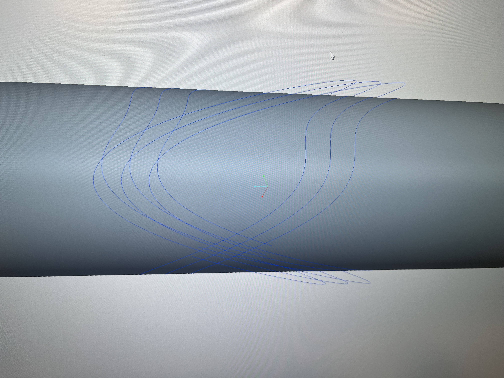
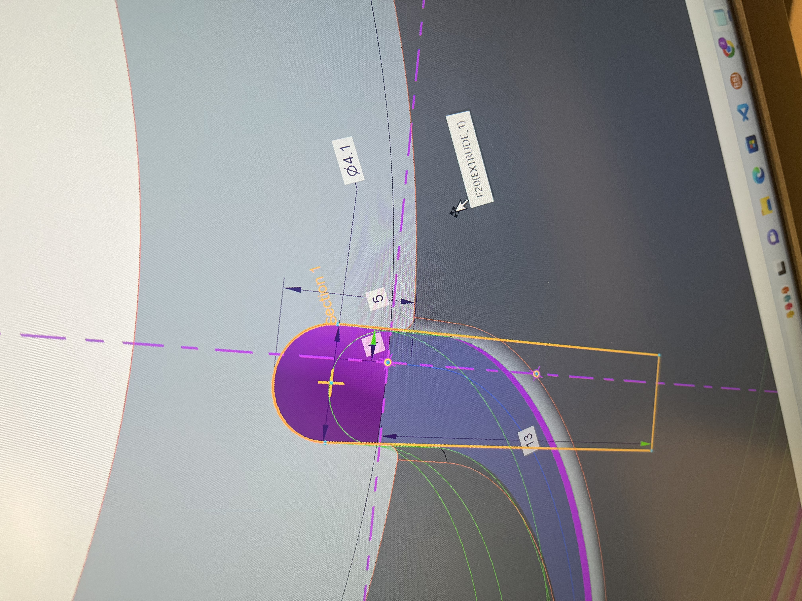
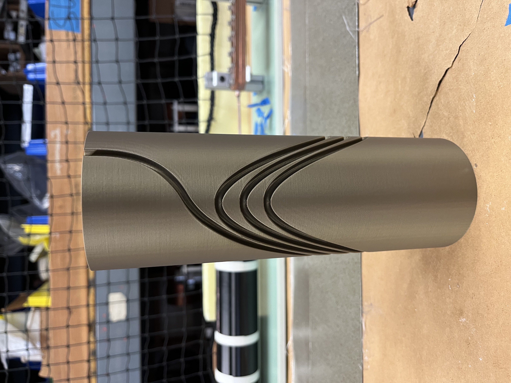
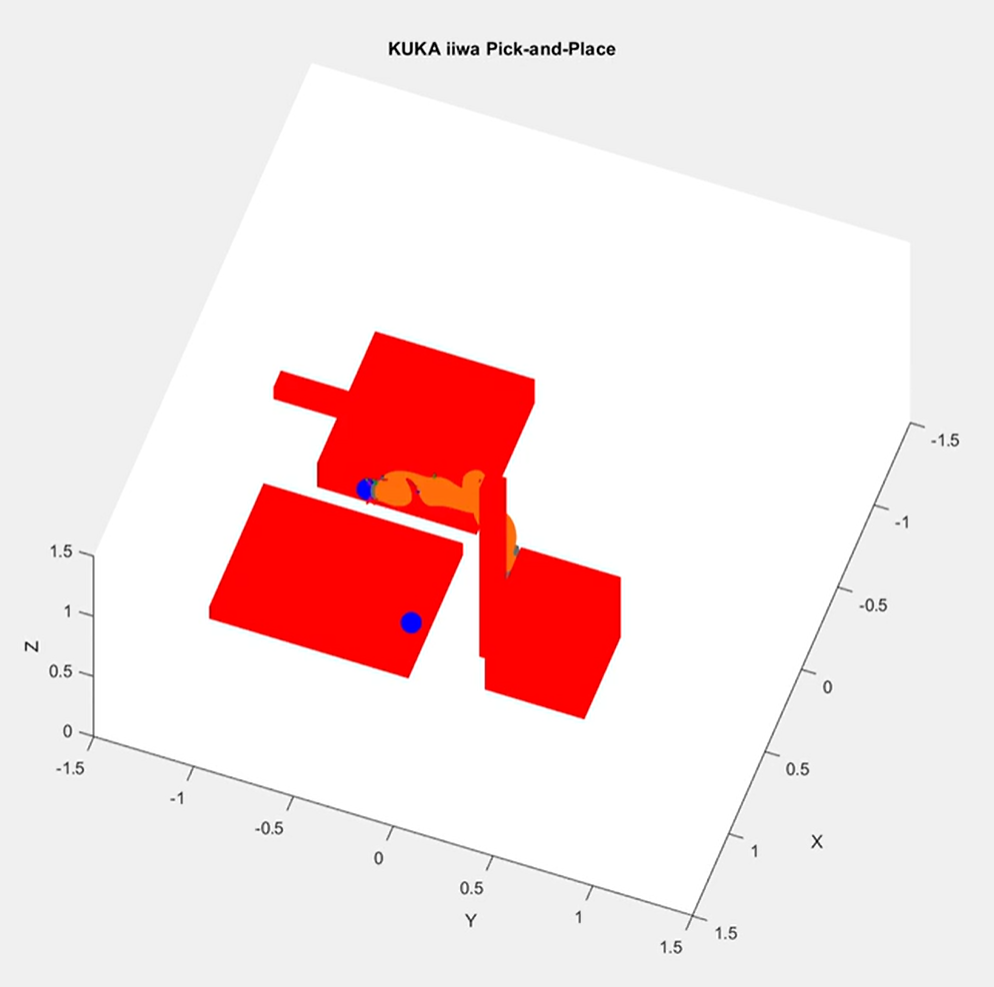

**WORK IN PROGRESS**
📧 zac.rd123@gmail.com • 💼 [LinkedIn](https://www.linkedin.com/in/zac-d-3b6807244/) • 📄 [Resume](Zachary_Dietderich_Resume.pdf)

Hi, I’m **Zachary Dietderich**, a Mechanical Engineering student at San Diego State University with a minor in Mathematics, graduating in May 2026. I have hands-on experience in **mechanical design, materials testing, and prototyping roles** at **Lawrence Berkeley National Laboratory and Applied Spectra**, where I worked on the development of superconducting magnets, automation tools in Python, and experimental testing systems.

---

# Projects
- [In-vacuum Z-Stage (Capstone — ASML × SDSU)](#asml-capstone)
- [Temperature Monitoring and Logging DAQ System (LabVIEW)](#temperature-monitoring-and-logging-daq-system-labview)
- [Modeling, Fabrication, Test Winding, and Automated Control (LBNL)](#modeling-fabrication-test-winding-and-automated-control-lbnl)
- [MATLAB Pick and Place Robot (SDSU)](#matlab-pick-and-place-robot-sdsu)
- [Superconducting Magnet Materials Testing (LBNL)](#superconducting-magnet-materials-testing-lbnl)

---

<h2 id="asml-capstone">
  In-vacuum Z-Stage and test visualization metrology of tin-H interactions in the EUV source - Capstone (ASML X SDSU)
</h2>

### What?
#### The problems:
- The vacuum chamber had to be opened, and the stage had to be adjusted manually with the operator leaning into the chamber.
- Repeatability was difficult with the Z-stage not being hard-mounted inside the vessel, and manual adjustment.
- The digital camera was outside the chamber, looking in through a viewport that didn't allow for high-quality imaging.
#### The goal:
- Develop an externally adjustable test platform within ASML’s onsite vacuum vessel that meets requirements and prevents damage to nearby critical components.
- Develop an adjustable digital camera system that lives in-vacuum and provides the operator with a good visualization of test samples during testing

### How?

The stage and digital camera systems live inside the vacuum chamber. The stage actuates vertically, holding samples at various distances from the sapphire tube (not shown in the CAD). At the same time, the digital camera is adjusted along the 80/20 rail to capture images/record the samples.

- The components were designed through the **mechanical design process**, starting with defining the problem, ideation (involving research and trade studies), CAD modeling, FEA, and prototyping to find the best solution.
- The assembly shown was modeled in **SolidWorks**, with FEA being done on the high-stress components.
  

  

- An LC2000N24-200250NE stage from Thomson Linear and a liquid-cooled breadboard from Thorlabs were purchased, along with necessary nuts, bolts, and set screws.
- The **challenge** for mounting the stage is that it has to sit inside a port hole, but cannot apply force to the vacuum flange. While also lightweight enough to be installed while leaning into the confined chamber.
- The **solution** is a modular design shown below, where the weight is applied to the horizontal metal inserts, which slot into the base, and are welded together. The set screws prevent rotation.

<table align="center">
  <tr>
    <td>
      
    </td>
    <td>
      
    </td>
  </tr>
</table>

### Results

- The accuracy and repeatability can now be controlled.
- Test efficiency is greatly improved with outside operation from the user.
- Safety requirements preventing users from entering the chamber are now met.

---

## Temperature Monitoring and Logging DAQ System (LabVIEW)
### What?
Designed and implemented a LabVIEW application to monitor and record temperature data from multiple thermocouples during the curing process of superconducting magnets. The system was intended to provide real-time visibility into oven temperature uniformity and to generate reliable temperature records for process validation and quality assurance.

<table align="center">
  <tr>
    <td>
      
    </td>
    <td>
      
    </td>
    <td>
      
    </td>
  </tr>
</table>

### How?
- Developed a LabVIEW-based data acquisition system interfacing with a temperature controller over Ethernet.
- Configured communication parameters, including IP address, device type, zone, and parameter IDs.
- Implemented robust initialization logic using a While Loop to ensurea  reliable connection to the controller.
- Acquired temperature data from up to eight thermocouple channels at user-defined intervals.
- Displayed live numerical readings and real-time XY plots of temperature versus time.
- Logged timestamped temperature data to a file for later analysis.
- Designed an operator-friendly front panel with configurable settings and clear status indicators.

<table align="center">
  <tr>
    <td></td>
    <td></td>
  </tr>
  <tr>
    <td></td>
    <td></td>
  </tr>
</table>

### Results
- Successfully monitored temperature profiles throughout long-duration curing cycles.
- Enabled real-time detection of temperature deviations between thermocouple locations.
- Produced complete, timestamped temperature logs for post-process analysis and documentation.
- Improved confidence in curing process consistency and thermal uniformity for superconducting magnet fabrication.
- Delivered a stable system capable of unattended operation during extended thermal runs.

---

## Modeling, Fabrication, Test Winding, and Automated Control (LBNL)
### Automated Superconducting Winder (Python)
I developed a Python-based control pipeline to replace and consolidate a complex set of legacy Excel spreadsheets used for superconducting wire winding. The system translates 3D mandrel path geometry into precise motion commands for an automated winding machine controlled via LabVIEW. **Added 2D and 3D visualization tools to verify geometry, detect angle discontinuities, and validate machine motion.** The script imports 3D path coordinates (X, Y, Z) exported from CAD models and performs vector-based geometric analysis to calculate:
- Local tangent angles along the winding path
- Axial direction changes to correctly resolve mandrel rotation logic
- Continuous rotation tracking with wrap-around handling across multiple revolutions

### Link to sample winding video

  

### Mandrel Development
Using Creo Parametric, I converted the analytical wire paths into 3D mandrel models. I fabricated physical mandrels via PLA 3D printing, optimizing the designs for printability and testing.
- Modeled analytical wire-path equations for quadrupole, sextupole, and combined-function magnet mandrels to define precise conductor geometry.
- Translated wire-path equations into parametric 3D mandrel models using Creo Parametric.
- Designed mandrel features to maintain continuous winding surfaces and accurate groove geometry.
- Enabled rapid geometry iteration by parameterizing pitch, radius, and axial length.
- Fabricated prototype mandrels via PLA 3D printing for fast, low-cost validation.
- Performed test windings on printed mandrels to verify winding stability and winder capabilities.
- Iterated mandrel designs based on winding results to improve alignment, robustness, and repeatability.
  

  <table>
    <tr>
      <td align="center">
        
         Combined-function wire modeling
      </td>
      <td align="center">
        
         3D wire-path curves (CAD)
      </td>
      <td align="center">
        
         PLA printed mandrel (test part)
      </td>
    </tr>
  </table>

### Results
- Improved analytical modeling, CAD, fabrication, and machine control.
- Eliminated manual spreadsheet logic from a safety-critical process.
- Improved repeatability and traceability of superconducting coil winding.
- Enabled rapid iteration on new multipole magnet geometries.

---

## MATLAB Pick and Place Robot (SDSU)
Built a collision-aware pick-and-place planner for a 7-DOF KUKA iiwa robot using IK, RRT motion planning, and automated feasibility recovery in cluttered environments.
- Developed a collision-aware pick-and-place system for a KUKA iiwa 7-DOF robot using MATLAB Robotics System Toolbox.
- Modeled robot links and environment obstacles using custom collision geometry (boxes, cylinders, spheres).
- Created environment objects with collision geometry for the robot to avoid while path planning.
- Implemented inverse kinematics with task-specific weighting for grasping and placement.
- Designed a fallback search algorithm to find the nearest feasible placement pose when the user-requested target was unreachable or in collision.
- Planned collision-free trajectories using RRT-based motion planning between home, pick, and place configurations.
- Generated smooth time-parameterized trajectories and animated object attachment during grasp execution.

### Sample video showing pick and place in environment

  

---

## Superconducting Magnet Materials Testing (LBNL)
