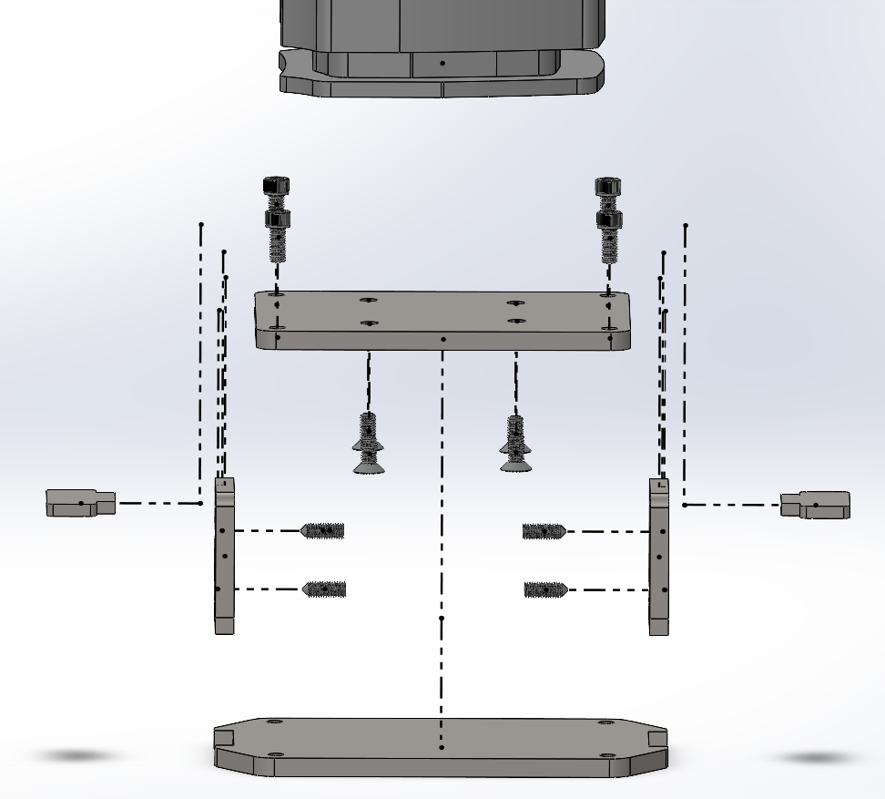

**WORK IN PROGRESS**
📧 zac.rd123@gmail.com • 💼 [LinkedIn](https://www.linkedin.com/in/zac-d-3b6807244/) • 📄 [Resume](Zachary_Dietderich_Resume.pdf)

Hi, I’m **Zachary Dietderich**, a Mechanical Engineering student at San Diego State University with a minor in Mathematics, graduating in May 2026. I have hands-on experience in **mechanical design, materials testing, and prototyping roles** at **Lawrence Berkeley National Laboratory and Applied Spectra**, where I worked on the development of superconducting magnets, automation tools in Python, and experimental testing systems.

---

# Projects
- [In-vacuum Z-Stage and test visualization metrology of tin-H interactions in the EUV source (Capstone — ASML × SDSU)](#in-vacuum-z-stage-and-test-visualization-metrology-of-tin-h-interactions-in-the-euv-source-capstone--asml--sdsu)
- [MATLAB Pick and Place Robot (SDSU)](#matlab-pick-and-place-robot-sdsu)
- [Superconducting Magnet Materials Testing (LBNL)](#superconducting-magnet-materials-testing-lbnl)
- [Python Automation Tools with 3D-Printed Coils (LBNL)](#python-automation-tools-with-3d-printed-coils-lbnl)

---

## In-vacuum Z-Stage and test visualization metrology of tin-H interactions in the EUV source (Capstone - ASML X SDSU)
### What?
#### The problems:
- The vacuum chamber had to be opened, and the stage had to be adjusted manually with the operator leaning into the chamber.
- Repeatability was difficult with the Z-stage not being hard-mounted inside the vessel, and manual adjustment.
- The digital camera was outside the chamber, looking in through a viewport that didn't allow for high-quality imaging.
#### The goal:
- Develop an externally adjustable test platform within ASML’s onsite vacuum vessel that meets requirements and prevents damage to nearby critical components.
- Develop an adjustable digital camera system that lives in-vacuum and provides the operator with a good visualization of test samples during testing

### How?

The stage and digital camera systems live inside the vacuum chamber. The stage actuates vertically, holding samples at various distances from the sapphire tube (not shown in the CAD). At the same time, the digital camera is adjusted along the 80/20 rail to capture images/record the samples.

- The components were designed through the **mechanical design process**, starting with defining the problem, ideation (involving research and trade studies), CAD modeling, FEA, and prototyping to find the best solution.
- The assembly shown was modeled in **SolidWorks**, with FEA being done on the high-stress components.
  

  

An LC2000N24-200250NE stage from Thomson Linear and a liquid-cooled breadboard from Thorlabs were purchased, along with necessary nuts, bolts, and set screws.

  

- The **challenge** for mounting the stage is that it has to sit inside a port hole, but cannot apply force to the vacuum flange. While also lightweight enough to be installed while leaning into the confined chamber.
- The **solution** is a modular design shown below, where the weight is applied to the horizontal metal inserts, which slot into the base, and are welded together. The set screws prevent any rotation from occurring.

  

### Results

- The accuracy and repeatability can now be controlled.
- Test efficiency is greatly improved with outside operation from the user.
- Safety requirements preventing users from entering the chamber are now met.

## MATLAB Pick and Place Robot (SDSU)

## Superconducting Magnet Materials Testing (LBNL)

## Python Automation Tools with 3D-Printed Coils (LBNL)

