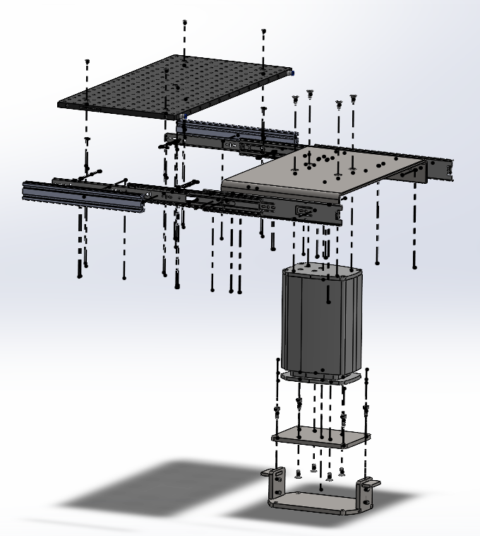

**WORK IN PROGRESS**
📧 zac.rd123@gmail.com • 💼 [LinkedIn](https://www.linkedin.com/in/zac-d-3b6807244/) • 📄 [Resume](Zachary_Dietderich_Resume.pdf)

Hi, I’m **Zachary Dietderich**, a Mechanical Engineering student at San Diego State University with a minor in Mathematics, graduating in May 2026. I have hands-on experience in mechanical design, materials testing, and prototyping roles at Lawrence Berkeley National Laboratory and Applied Spectra, where I worked on the development of superconducting magnets, automation tools in Python, and experimental testing systems.

---

## Projects
- In-vacuum Z-Stage and test visualization metrology of tin-H interactions in the EUV source - Capstone (ASML X SDSU)
- MATLAB Pick and Place Robot (SDSU)
- Superconducting magnet materials testing (LBNL)
- Python automation tools with 3D printed coils (LBNL)

---

### In-vacuum Z-Stage and test visualization metrology of tin-H interactions in the EUV source - Capstone (ASML X SDSU)**

  

  

