**Website in development**
📧 zac.rd123@gmail.com • 💼 [LinkedIn](https://www.linkedin.com/in/zac-d-3b6807244/) • 📄 [Resume](Resume-2-1-2026_linkslong.pdf)

Hi, I’m **Zachary Dietderich**, a Mechanical Engineering student at San Diego State University with a minor in Mathematics, graduating in May 2026. I have hands-on experience in **mechanical design, materials testing, and prototyping roles** at **Lawrence Berkeley National Laboratory and Applied Spectra**, where I worked on the development of superconducting magnets, automation tools in Python, and experimental testing systems.

---

# Projects
- [In-vacuum Z-Stage (Senior Capstone — ASML and SDSU)](#asml-capstone)
- [Engine Dynomometer (Aztec Baja Racing)](#engine-dynomometer-aztec-baja-racing)
- [Temperature Monitoring and Logging DAQ System (LabVIEW)](#temperature-monitoring-and-logging-daq-system-labview)
- [Modeling, Fabrication, Test Winding, and Automated Control (LBNL)](#modeling-fabrication-test-winding-and-automated-control-lbnl)
- [MATLAB Pick and Place Robot (SDSU)](#matlab-pick-and-place-robot-sdsu)
- [Superconducting Magnet Materials Testing (LBNL)](#superconducting-magnet-materials-testing-lbnl)

---

<h2 id="asml-capstone">
  In-vacuum Z-Stage and test visualization metrology of tin-Hydrogen interactions in the EUV source - Capstone (ASML X SDSU)
</h2>

### What
#### The problems:
- Presently, the vacuum chamber has to be opened, and the stage height has to be adjusted manually with the operator leaning into the chamber.
- Repeatability is difficult with the Z-stage not being hard-mounted inside the vessel.
- The digital camera was outside the chamber, looking in through a viewport that didn't allow for high-quality imaging.
#### The goal:
- Develop a test platform with external vertical adjustability within ASML’s vacuum vessel. This system has to meet translation and accuracy requirements, as well as prevents damage to nearby critical components.
- Develop an adjustable digital camera system that is in the vacuum chamber and provides the operator with a high-resolution FOV of the samples on the mounting board.

### How

The stage and digital camera systems reside inside the vacuum chamber. The stage actuates vertically, holding samples at various distances from the sapphire tube (not shown in the CAD). At the same time, the digital camera is adjusted along the 80/20 rail to capture images or video of the samples.

- The components were designed through the **mechanical design process**, starting by defining the problem, ideation (involving research and trade studies), CAD modeling, FEA, and prototyping to find the best solution.
- The assembly shown was modeled in **SolidWorks**, with FEA being done on the high-stress components to show they met FOS (Factor of Safety, Material Strength / Yield Strength) requirements.
  

  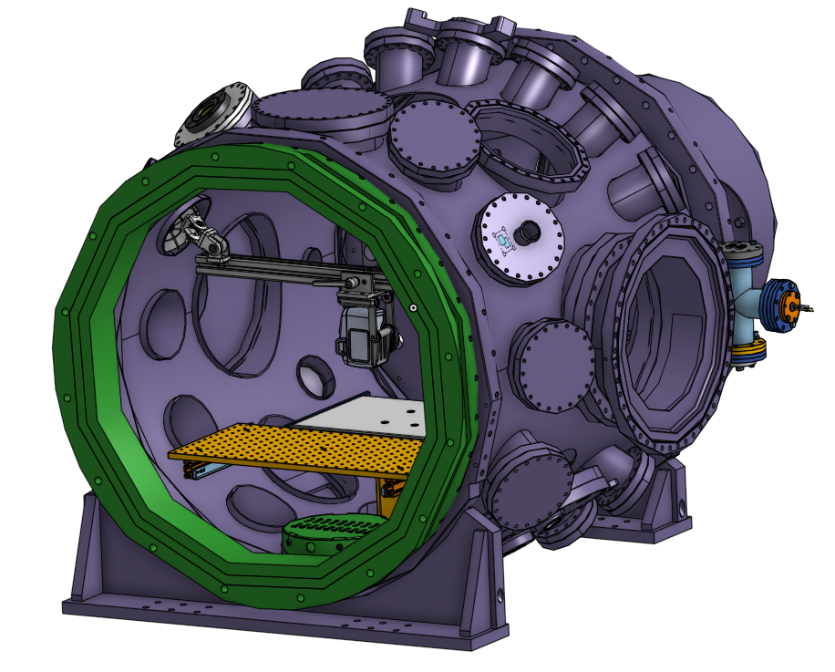

- An LC2000N24-200250NE stage from Thomson Linear and a liquid-cooled breadboard from Thorlabs were purchased, along with necessary nuts, bolts, and set screws.
- The **challenge** for mounting the stage is that it has to sit inside a port hole, but cannot apply force to the vacuum flange. While also lightweight enough to be installed while leaning into the confined chamber.
- The **solution** is a modular design shown below, where the weight is applied to the horizontal metal inserts, which slot into the base, and are welded together. The set screws prevent rotation.

<table align="center">
  <tr>
    <td>
      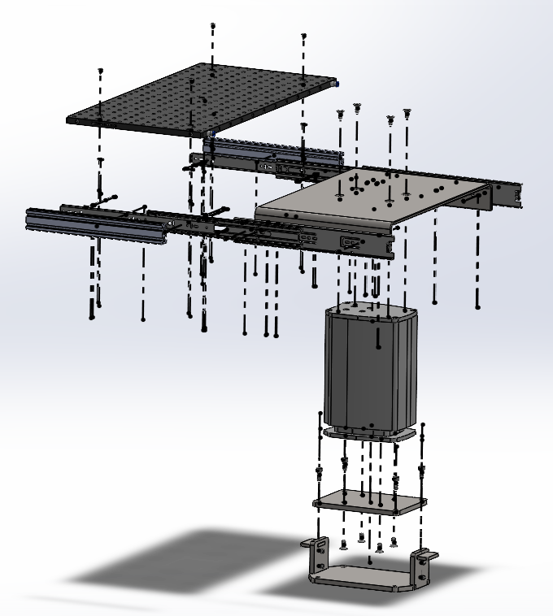
    </td>
    <td>
      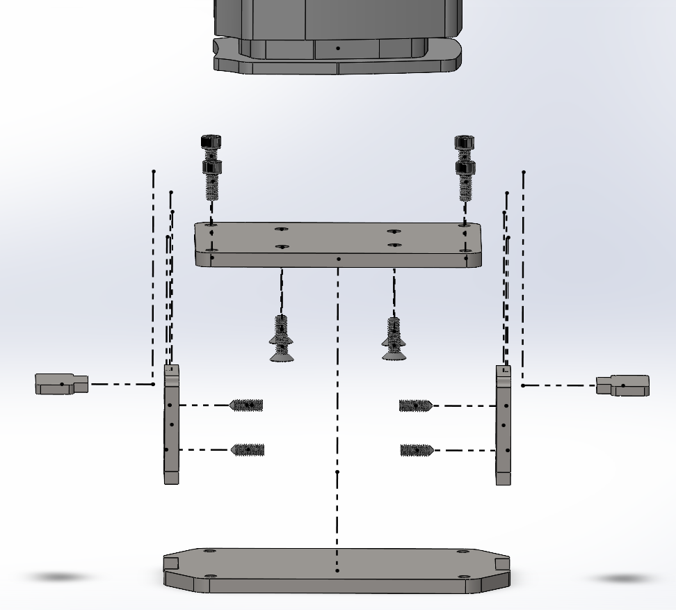
    </td>
  </tr>
</table>

### Results

- The accuracy and repeatability can now be controlled.
- Test efficiency is greatly improved with outside operation from the user.
- Safety requirements preventing users from entering the chamber are now met.

---

<h2 id="engine-dynomometer-aztec-baja-racing">
  Engine Dynomometer (Aztec Baja Racing)
</h2>

### Project Overview
This project was driven by the need to accurately measure the performance of the engine and transmission. Evaluating the efficiency of the newly designed and built CVT compared to the previously used CVT. Commercial dynamometers at this scale are limited and expensive, so we designed and built a custom solution capable of measuring horsepower through torque and RPM.

### Early Design (CAD)
The dynamometer was designed in CAD to be compact, with sensor integration considered from the outset. Mounting features and geometry were developed to incorporate a lever arm for load cell–based torque measurement, a pressure transducer within the hydraulic system, and a Hall effect sensor for RPM detection. A custom 3D-printed shaft component was created to house embedded magnets, enabling accurate rotational sensing. The overall layout ensured proper alignment, structural rigidity, and easy serviceability of both mechanical and electrical components.

<table align="center">
  <tr>
    <td>
      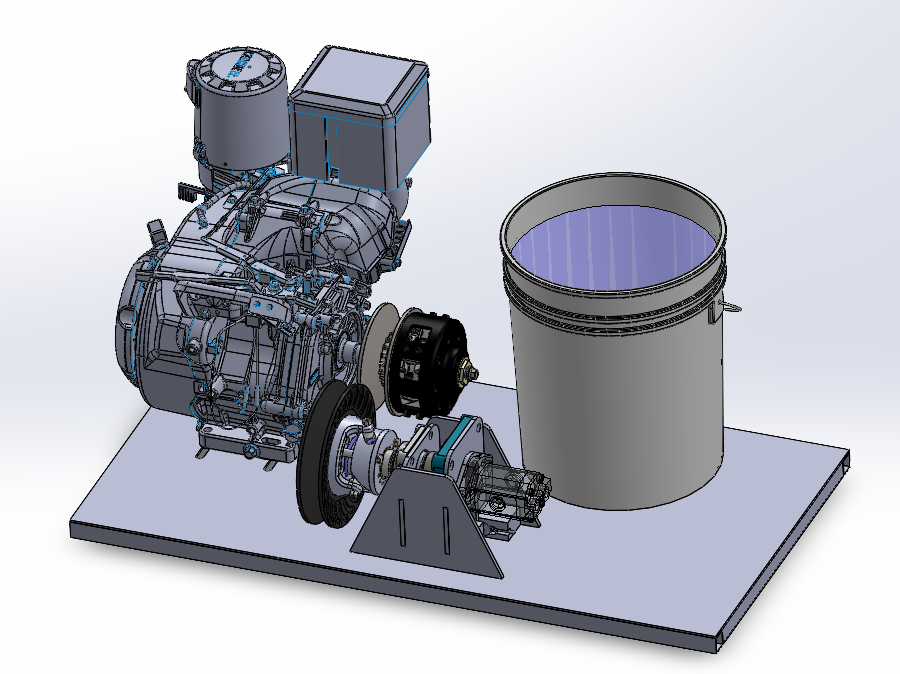
      
Full Assembly

    </td>
    <td>
      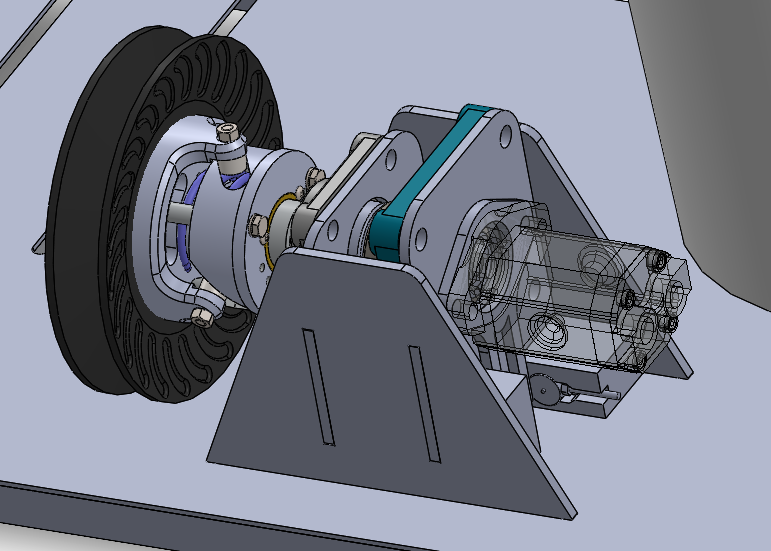
      
Driven CVT and Hydraulic Pump

    </td>
    <td>
      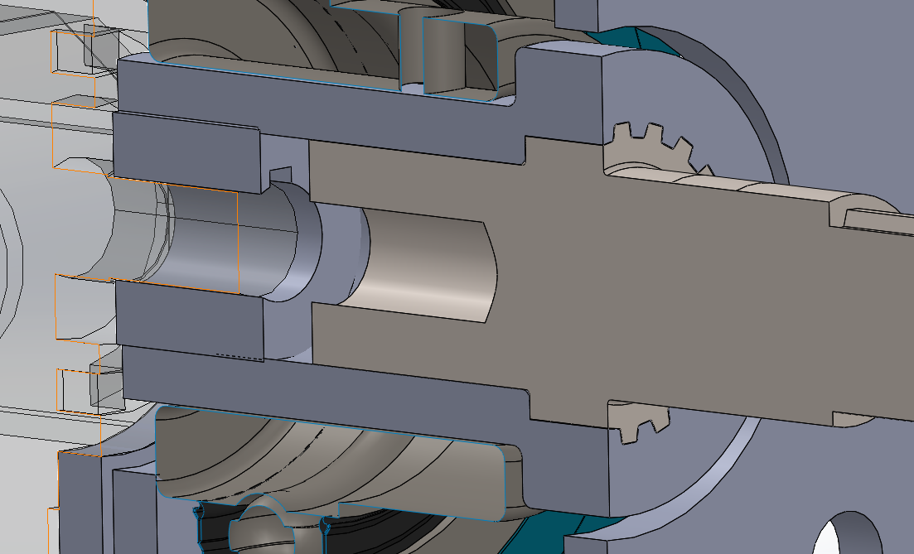
      
Adapter Connecting Pump (Left) and Spline (Right)

    </td>
  </tr>
</table>

### Build & Assembly
The system was fabricated and assembled using a combination of machined components, waterjet-cut steel sheet metal, and 3D-printed parts. Sheet metal mounting features were MIG-welded to a base plate, with rectangular hollow sections (RHS) added underneath to increase structural rigidity and overall stiffness. Key instrumentation included a load cell for torque measurement, a pressure transducer for monitoring hydraulic load, a Hall effect sensor for RPM measurement, and an Arduino-based data acquisition system to collect and process sensor data in real time.

<table align="center">
  <tr>
    <td>
      
      
3D Printed Spline to Pump Adapter

    </td>
    <td>
      
      
Hall Effect Sensor and printed magnet attachement

    </td>
    <td>
      
      
Adapter Connecting Pump (Left) and Spline (Right)

    </td>
  </tr>
</table>

### Current System & Testing
The dynamometer is currently operational and capable of measuring transmission output by correlating torque and rotational speed. It has been used to evaluate CVT performance compared to the previous CVT, providing initial insights into power transmission efficiency.

Ongoing testing has shown areas for improvement. A custom spline-to-pump adapter, initially 3D printed in PETG, experienced softening and stripping under high heat, load, and vibration. Additionally, vibration-induced movement of the hydraulic pump showed the need for the design and fabrication of a dedicated pump holder to maintain proper engagement. A more robust replacement adapter is currently being manufactured using wire EDM and CNC machining to improve strength and reliability. These iterations are informing continued refinement of the system for sustained operation under higher loads.

---

## Temperature Monitoring and Logging DAQ System (LabVIEW)
### What
Designed and implemented a LabVIEW application to monitor and record temperature data from multiple thermocouples during the heat treatment (epoxy curing for this project) of superconducting magnets. The system was intended to provide real-time visibility into oven temperature uniformity and to generate reliable temperature records for process validation and quality assurance.

<table align="center">
  <tr>
    <td>
      
    </td>
    <td>
      
    </td>
    <td>
      
    </td>
  </tr>
</table>

### How
- Developed a LabVIEW-based data acquisition system interfacing with a temperature controller over Ethernet.
- Configured communication parameters, including IP address, device type, zone, and parameter IDs.
- Implemented robust initialization logic using a While Loop to ensurea  reliable connection to the controller.
- Acquired temperature data from up to eight thermocouple channels at user-defined intervals.
- Displayed live numerical readings and real-time XY plots of temperature versus time.
- Logged timestamped temperature data to a file for later analysis.
- Designed an operator-friendly front panel with configurable settings and clear status indicators.

<table align="center">
  <tr>
    <td></td>
    <td></td>
  </tr>
  <tr>
    <td></td>
    <td></td>
  </tr>
</table>

### Results

- Successfully monitored temperature profiles throughout long-duration curing cycles.
- Enabled real-time detection of temperature deviations between thermocouple locations.
- Produced complete, timestamped temperature logs for post-process analysis and documentation.
- Improved confidence in curing process consistency and thermal uniformity for superconducting magnet fabrication.
- Delivered a stable system capable of unattended operation during extended thermal runs.

---

## Modeling, Fabrication, Test Winding, and Automated Control (LBNL)
### Automated Superconducting Winder (Python)
I developed a Python-based control pipeline to replace and consolidate a complex set of legacy Excel spreadsheets used for superconducting wire winding. The system translates 3D mandrel path geometry into precise motion commands for an automated winding machine controlled via LabVIEW. **Added 2D and 3D visualization tools to verify geometry, detect angle discontinuities, and validate machine motion.** The script imports 3D path coordinates (X, Y, Z) exported from CAD models and performs vector-based geometric analysis to calculate:
- Local tangent angles along the winding path
- Axial direction changes to correctly resolve mandrel rotation logic
- Continuous rotation tracking with wrap-around handling across multiple revolutions

### Link to sample winding video (linked in image below)

  <a href="https://youtu.be/kcI7nIB2wTw">
    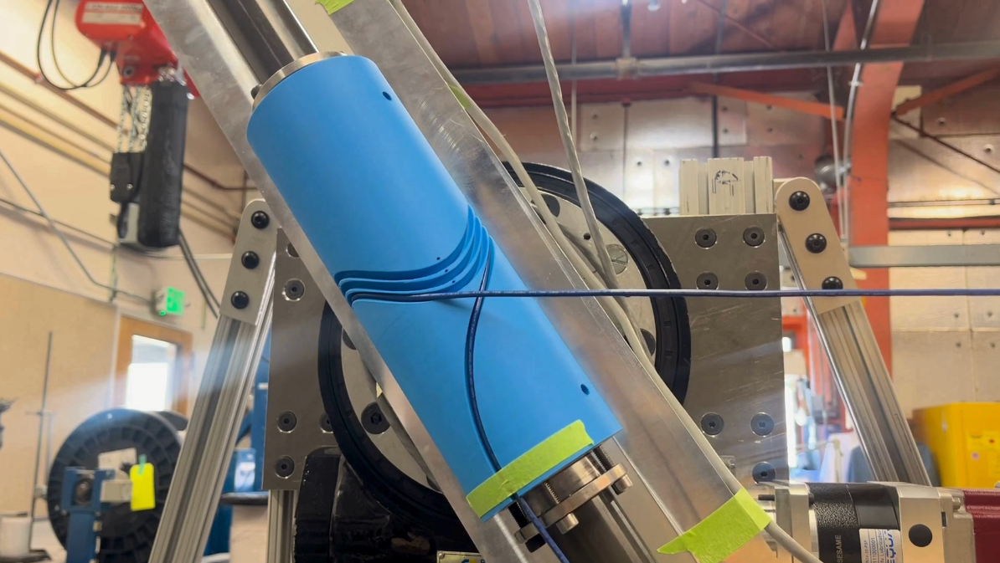
  </a>

### Mandrel Development
Using Creo Parametric, I converted the analytical wire paths into 3D mandrel models. I fabricated physical mandrels via PLA 3D printing, optimizing the designs for printability and testing.
- Modeled analytical wire-path equations for quadrupole, sextupole, and combined-function magnet mandrels to define precise conductor geometry.
- Translated wire-path equations into parametric 3D mandrel models using Creo Parametric.
- Designed mandrel features to maintain continuous winding surfaces and accurate groove geometry.
- Enabled rapid geometry iteration by parameterizing pitch, radius, and axial length.
- Fabricated prototype mandrels via PLA 3D printing for fast, low-cost validation.
- Performed test windings on printed mandrels to verify winding stability and winder capabilities.
- Iterated mandrel designs based on winding results to improve alignment, robustness, and repeatability.
  

  <table>
    <tr>
      <td align="center">
        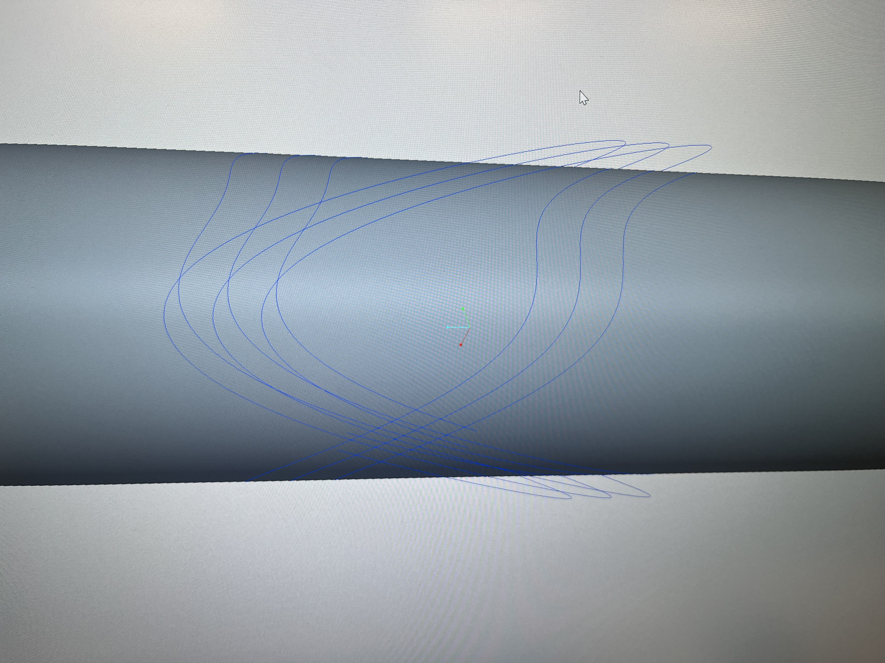
         Combined-function wire modeling
      </td>
      <td align="center">
        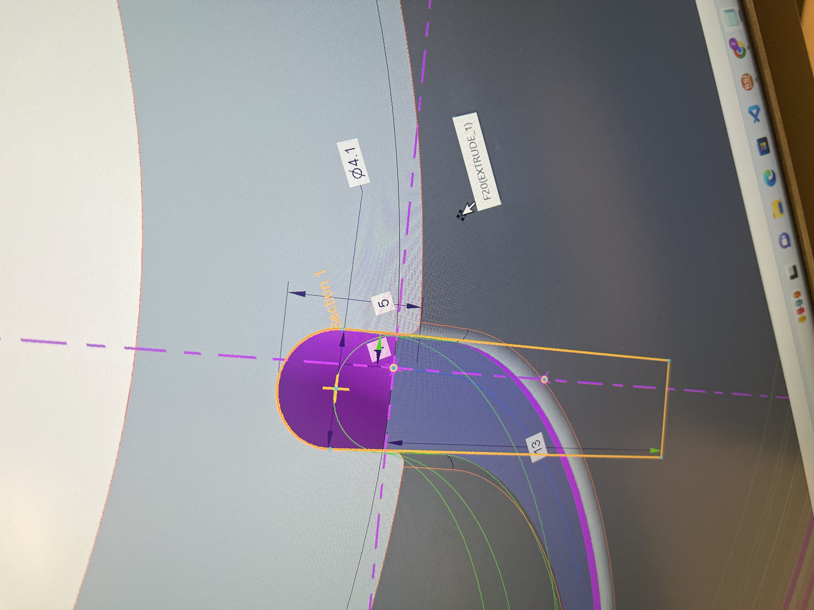
         3D wire-path curves (CAD)
      </td>
      <td align="center">
        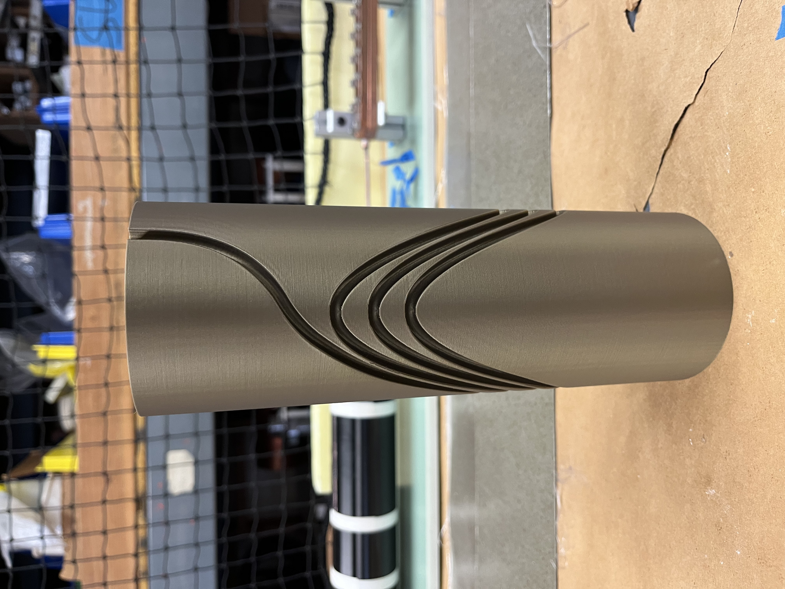
         PLA printed mandrel (test part)
      </td>
    </tr>
  </table>

### Results
- Improved analytical modeling, CAD, fabrication, and machine control.
- Eliminated manual spreadsheet logic from a safety-critical process.
- Improved repeatability and traceability of superconducting coil winding.
- Enabled rapid iteration on new multipole magnet geometries.

---

## MATLAB Pick and Place Robot (SDSU)
Built a collision-aware pick-and-place planner for a 7-DOF KUKA iiwa robot using IK, RRT motion planning, and automated feasibility recovery in cluttered environments.
- Developed a collision-aware pick-and-place system for a KUKA iiwa 7-DOF robot using MATLAB Robotics System Toolbox.
- Modeled robot links and environment obstacles using custom collision geometry (boxes, cylinders, spheres).
- Created environment objects with collision geometry for the robot to avoid while path planning.
- Implemented inverse kinematics with task-specific weighting for grasping and placement.
- Designed a fallback search algorithm to find the nearest feasible placement pose when the user-requested target was unreachable or in collision.
- Planned collision-free trajectories using RRT-based motion planning between home, pick, and place configurations.
- Generated smooth time-parameterized trajectories and animated object attachment during grasp execution.

### Sample video showing pick and place in the environment (linked in image below)

  <a href="https://youtu.be/w3WNetFs1dY">
    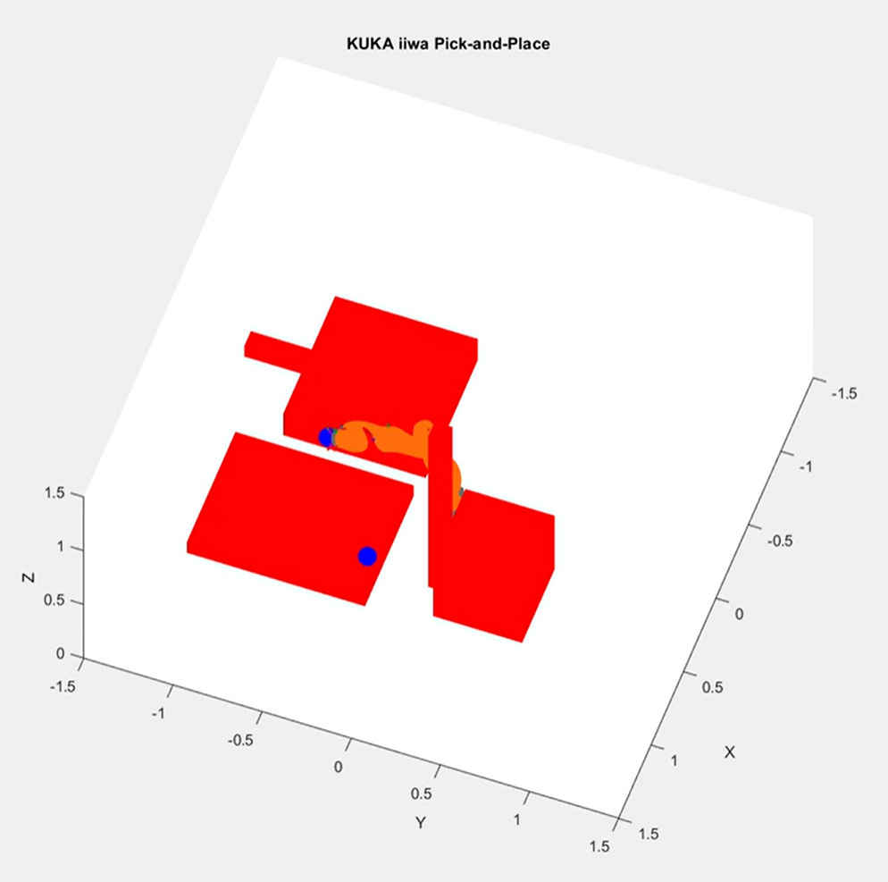
  </a>

---

## Superconducting Magnet Materials Testing (LBNL)
